# Automacao-ServeRest

End-to-End (E2E) test automation project for the ServeRest application using Cypress with Gherkin (BDD).

This is a **QA Automation / CI-CD laboratory**: a portfolio project that demonstrates a realistic test automation architecture and a realistic CI/CD pipeline design, built around the public [ServeRest](https://serverest.dev) reference application. The test suite validates critical user flows, keeps scenarios independent, and provides categorized suites (smoke, sanity, regression, negative, API) for different points in the pipeline.

Technologies used include Cypress, Cucumber (Gherkin BDD), Cypress Cucumber Preprocessor (@badeball), JavaScript, ESLint, Prettier, Node.js, Jenkins and Docker.

## Test Architecture

Gherkin `.feature` files describe scenarios in business language. Each step maps to a step definition, which drives the UI through Page Objects and reusable custom commands, or calls the ServeRest API directly for API-focused scenarios:

```
Feature files (Gherkin)
    ↓
Step Definitions
    ↓
Page Objects / Custom Commands
    ↓
Cypress
    ↓
ServeRest UI (front.serverest.dev) / API (serverest.dev)
```

Project structure — the `cypress/e2e` directory is organized as follows:

- `features/`: Contains all Gherkin `.feature` files (categorized by `@smoke`, `@sanity`, `@regression`, `@negative` and `@api` tags).
- `step_definitions/`: Contains reusable JavaScript files mapping Gherkin steps to actions.

Page objects are located under `cypress/support/pages`. Reusable custom commands (API helpers, cleanup tracking, login helpers) are in `cypress/support/commands.js`.

The E2E strategy focuses on scenario independence, minimal duplication, and categorized test execution — every scenario that creates data through the API is tracked and cleaned up automatically after the scenario runs (see `cypress/e2e/step_definitions/hooks.js`).

## Test Tag Strategy

This project uses five Cucumber tags to select different execution suites. Tags are **not mutually exclusive** — a scenario can belong to more than one suite at the same time. For example, a negative scenario (`@negative`) may also be part of the regression suite (`@regression`), and a scenario tagged `@smoke` is also part of `@sanity`. The tags exist to support different execution strategies at different points in the pipeline, not to split all scenarios into independent, non-overlapping groups.

- **`@smoke`** — Critical business flows used for fast feedback on feature branches (login, product search, registration).
- **`@sanity`** — A focused, pre-deployment confidence gate run on `main` after merge, before the simulated release proceeds. Currently a superset of `@smoke` plus one additional critical shopping-list flow.
- **`@regression`** — Scenarios selected to detect meaningful functional regressions across the application, run on every Pull Request. In `products.feature` and `users.feature`, every automated scenario is currently considered regression-worthy. In `login.feature`, `@regression` is a deliberately narrower subset that excludes the single-field-empty negative variants and the API contract scenario, which remain covered under `@negative`/`@api` but are not considered critical enough to gate every regression run.
- **`@negative`** — Scenarios validating invalid input, validation rules, error handling, or unsuccessful business behavior, whether driven through the UI or directly through the API.
- **`@api`** — Scenarios whose primary purpose is direct API/contract validation (status codes, headers, response structure), independent of the UI.

### Current scenario counts (validated baseline)

| Tag           | Scenarios |
| ------------- | --------- |
| `@smoke`      | 3         |
| `@sanity`     | 4         |
| `@regression` | 21        |
| `@negative`   | 12        |
| `@api`        | 4         |

These counts represent **selected** scenarios per suite and should not be summed to calculate a total, since tags overlap by design. The project currently contains **25 unique scenarios** in total.

### Running a suite

To run the tests locally, install dependencies with `npm install`, execute all tests with `npx cypress run`, or run a categorized suite:

| Suite      | Command                     | Purpose                                                        |
| ---------- | ---------------------------- | -------------------------------------------------------------- |
| Smoke      | `npm run cy:run:smoke`      | Fast validation of critical flows on feature branches.         |
| Sanity     | `npm run cy:run:sanity`     | Pre-deployment confidence gate on `main`, before simulated release. |
| Regression | `npm run cy:run:regression` | Broader validation on Pull Requests before merge.               |
| Negative   | `npm run cy:run:negative`   | Focused validation of validation/error behavior.                |
| API        | `npm run cy:run:api`        | Focused validation of API contracts/integration behavior.       |

## CI/CD Architecture

**Jenkins is the authoritative CI/CD orchestrator for this project.** GitHub Actions was used earlier in this project's evolution but has been retired; its workflow files no longer exist in this repository. GitHub is still used for source control, Pull Requests and branch protection.

### GitHub vs Jenkins responsibilities

| | GitHub | Jenkins |
| --- | --- | --- |
| Source control | ✅ | — |
| Pull Requests | ✅ | — |
| Branch protection | ✅ | — |
| Required quality gate (status check) | ✅ (enforces it) | ✅ (provides the check result) |
| CI execution (lint, format, tests) | — | ✅ |
| Simulated deployment / release evidence | — | ✅ |

### Pipeline routing

| Trigger | Steps | Deployment |
| --- | --- | --- |
| **Feature branch push** | `npm ci` → Lint → Format check → `@smoke` | none |
| **Pull Request → `main`** | `npm ci` → Lint → Format check → `@regression` → Jenkins required check | none |
| **`main` after merge** | `npm ci` → Lint → Format check → `@sanity` → Simulated Deployment → Post-Simulated-Deployment `@smoke` → Release Evidence | simulated only |



```mermaid
flowchart TD
    subgraph FB["Feature Branch"]
        A1["Push to feature branch"] --> A2["npm ci"]
        A2 --> A3["Lint + Format Check"]
        A3 --> A4["Smoke suite"]
    end

    subgraph PR["Pull Request to main"]
        B1["Open / update PR"] --> B2["npm ci"]
        B2 --> B3["Lint + Format Check"]
        B3 --> B4["Regression suite"]
        B4 --> B5["Jenkins required check"]
        B5 --> B6["Merge to main"]
    end

    subgraph MAIN["main (post-merge)"]
        C1["Merge commit on main"] --> C2["npm ci"]
        C2 --> C3["Lint + Format Check"]
        C3 --> C4["Sanity suite"]
        C4 --> C5["Simulated Deployment (no real environment contacted)"]
        C5 --> C6["Post-Simulated-Deployment Smoke (against pre-existing ServeRest reference target)"]
        C6 --> C7["Release Evidence"]
    end
```

The ServeRest reference target (`front.serverest.dev` / `serverest.dev`) is a pre-existing public application independent of this pipeline — the Simulated Deployment stage does not create, provision, or modify it in any way.

### Trigger model

This Jenkins instance runs locally and is **not** exposed publicly to GitHub — there is no inbound GitHub webhook reaching it. Instead, its Multibranch Pipeline job periodically indexes the repository outbound (currently every 5 minutes) to discover new branches, commits and Pull Requests. This means there can be a short delay (up to one indexing interval) between a push/PR event on GitHub and the corresponding Jenkins build starting — this is **not** real-time webhook triggering. Jenkins authenticates to GitHub via a GitHub App integration to read repository state and publish check results back to Pull Requests and commits.

### Quality gates and failure behavior

- **Lint failure** → the pipeline fails immediately (Lint stage runs before any test stage).
- **Format check failure** → the pipeline fails immediately.
- **Feature Smoke failure** → the feature-branch build fails.
- **PR Regression failure** → the Jenkins required status check fails, which blocks normal merge into `main` under branch protection.
- **Main Sanity failure** → the pipeline stops before Simulated Deployment; none of the simulated-release stages execute.
- **Post-Simulated-Deployment Smoke failure** → the pipeline fails after the Simulated Deployment stage has already run. Under Jenkins' default Declarative Pipeline behavior, the subsequent **Release Evidence** stage is skipped when an earlier stage fails, so release evidence is **not currently guaranteed** to be produced on a Post-Simulated-Deployment Smoke failure. Ensuring evidence is always captured, even on a late-stage failure, is a planned future improvement, not yet implemented.

## Simulated Deployment — Important Limitation

**This repository is a QA automation / CI-CD laboratory. There is no owned DEV, UAT, PREPROD, or PROD deployment environment.**

The "Simulated Deployment" stage in Jenkins does not deploy any real application. It exists to demonstrate deployment/release orchestration — packaging a release, generating and validating a release manifest, and recording deployment evidence — **without publishing an application to any real environment**. No real deployment target is ever contacted by this stage.

Post-Simulated-Deployment Smoke validates critical user journeys against the ServeRest reference target **after** the simulated deployment stage. Because this laboratory has no owned DEV/UAT/PREPROD/PROD environment, this stage demonstrates the post-deployment validation architecture rather than validating a newly deployed application instance. The ServeRest reference target it runs against already exists independently of this pipeline.

### Release evidence

On a successful `main` build, Jenkins packages a release using an explicit allowlist of paths (Cypress suite, support code, configuration, `package.json`/`package-lock.json`, this README, and the `Jenkinsfile` itself — see the `Prepare Simulated Release` stage in `Jenkinsfile` for the exact, current list), then generates and validates a `release-manifest.json`. The manifest and subsequent release-evidence file explicitly record: that the deployment was simulated, that no real deployment was performed, the source branch and commit, Jenkins build information, the release contents, a description of the (unmodified) target, the environment limitation stated above, and the scope of the post-deployment validation. These files are archived as Jenkins build artifacts.

## Project Limitations

- This is a laboratory/portfolio architecture, not production infrastructure.
- No owned DEV, UAT, PREPROD, or PROD deployment environment exists.
- The CD stage is explicitly simulated; no real application deployment occurs.
- Post-deployment validation runs against a pre-existing public reference target, not a newly deployed instance.
- Jenkins discovers repository changes via periodic (5-minute) indexing, not an inbound real-time webhook.
- Release evidence is not yet guaranteed to be produced when a late-stage (Post-Simulated-Deployment Smoke) failure occurs — a planned improvement.
