# Automacao-ServeRest

End-to-End (E2E) test automation project for the ServeRest application using Cypress with Gherkin (BDD).

This is a **QA Automation / CI-CD laboratory**: a portfolio project that demonstrates a realistic test automation architecture and a realistic CI/CD pipeline design, built around the public [ServeRest](https://serverest.dev) reference application. The test suite validates critical user flows, keeps scenarios independent, and provides categorized suites (smoke, sanity, regression, negative, API) for different points in the pipeline.

Technologies used include Cypress, Cucumber (Gherkin BDD), Cypress Cucumber Preprocessor (@badeball), JavaScript, ESLint, Prettier, Node.js, Jenkins and Docker.

## Test Architecture

Gherkin `.feature` files describe scenarios in business language. Each step maps to a step definition, which drives the UI through Page Objects and reusable custom commands, or calls the ServeRest API directly for API-focused scenarios:

```
Feature files (Gherkin)
    ↓
Step Definitions
    ↓
Page Objects / Custom Commands
    ↓
Cypress
    ↓
ServeRest UI (front.serverest.dev) / API (serverest.dev)
```

Project structure — the `cypress/e2e` directory is organized as follows:

- `features/`: Contains all Gherkin `.feature` files (categorized by `@smoke`, `@sanity`, `@regression`, `@negative` and `@api` tags).
- `step_definitions/`: Contains reusable JavaScript files mapping Gherkin steps to actions.

Page objects are located under `cypress/support/pages`. Reusable custom commands (API helpers, cleanup tracking, login helpers) are in `cypress/support/commands.js`.

The E2E strategy focuses on scenario independence, minimal duplication, and categorized test execution — every scenario that creates data through the API is tracked and cleaned up automatically after the scenario runs (see `cypress/e2e/step_definitions/hooks.js`).

## Test Tag Strategy

This project uses five Cucumber tags to select different execution suites. Tags are **not mutually exclusive** — a scenario can belong to more than one suite at the same time. For example, a negative scenario (`@negative`) may also be part of the regression suite (`@regression`), and a scenario tagged `@smoke` is also part of `@sanity`. The tags exist to support different execution strategies at different points in the pipeline, not to split all scenarios into independent, non-overlapping groups.

- **`@smoke`** — Critical business flows used for fast feedback on feature branches (login, product search, registration).
- **`@sanity`** — A focused, pre-deployment confidence gate run on `main` after merge, before the simulated release proceeds. Currently a superset of `@smoke` plus one additional critical shopping-list flow.
- **`@regression`** — Scenarios selected to detect meaningful functional regressions across the application, run on every Pull Request. In `products.feature` and `users.feature`, every automated scenario is currently considered regression-worthy. In `login.feature`, `@regression` is a deliberately narrower subset that excludes the single-field-empty negative variants and the API contract scenario, which remain covered under `@negative`/`@api` but are not considered critical enough to gate every regression run.
- **`@negative`** — Scenarios validating invalid input, validation rules, error handling, or unsuccessful business behavior, whether driven through the UI or directly through the API.
- **`@api`** — Scenarios whose primary purpose is direct API/contract validation (status codes, headers, response structure), independent of the UI.

### Current scenario counts (validated baseline)

| Tag           | Scenarios |
| ------------- | --------- |
| `@smoke`      | 3         |
| `@sanity`     | 4         |
| `@regression` | 21        |
| `@negative`   | 12        |
| `@api`        | 4         |

These counts represent **selected** scenarios per suite and should not be summed to calculate a total, since tags overlap by design. The project currently contains **25 unique scenarios** in total.

### Running a suite

To run the tests locally, install dependencies with `npm install`, execute all tests with `npx cypress run`, or run a categorized suite:

| Suite      | Command                     | Purpose                                                             |
| ---------- | --------------------------- | ------------------------------------------------------------------- |
| Smoke      | `npm run cy:run:smoke`      | Fast validation of critical flows on feature branches.              |
| Sanity     | `npm run cy:run:sanity`     | Pre-deployment confidence gate on `main`, before simulated release. |
| Regression | `npm run cy:run:regression` | Broader validation on Pull Requests before merge.                   |
| Negative   | `npm run cy:run:negative`   | Focused validation of validation/error behavior.                    |
| API        | `npm run cy:run:api`        | Focused validation of API contracts/integration behavior.           |

## CI/CD Architecture

**Jenkins is the authoritative CI/CD orchestrator for this project.** GitHub Actions was used earlier in this project's evolution but has been retired; its workflow files no longer exist in this repository. GitHub is still used for source control, Pull Requests and branch protection.

### GitHub vs Jenkins responsibilities

|                                         | GitHub           | Jenkins                        |
| --------------------------------------- | ---------------- | ------------------------------ |
| Source control                          | ✅               | —                              |
| Pull Requests                           | ✅               | —                              |
| Branch protection                       | ✅               | —                              |
| Required quality gate (status check)    | ✅ (enforces it) | ✅ (provides the check result) |
| CI execution (lint, format, tests)      | —                | ✅                             |
| Simulated deployment / release evidence | —                | ✅                             |

### Pipeline routing

| Trigger                   | Steps                                                                                                                     | Deployment     |
| ------------------------- | ------------------------------------------------------------------------------------------------------------------------- | -------------- |
| **Feature branch push**   | `npm ci` → Lint → Format check → `@smoke`                                                                                 | none           |
| **Pull Request → `main`** | `npm ci` → Lint → Format check → `@regression` → Jenkins required check                                                   | none           |
| **`main` after merge**    | `npm ci` → Lint → Format check → `@sanity` → Simulated Deployment → Post-Simulated-Deployment `@smoke` → Release Evidence | simulated only |

```mermaid
flowchart TD
    subgraph FB["Feature Branch"]
        A1["Push to feature branch"] --> A2["npm ci"]
        A2 --> A3["Lint + Format Check"]
        A3 --> A4["Smoke suite"]
    end

    subgraph PR["Pull Request to main"]
        B1["Open / update PR"] --> B2["npm ci"]
        B2 --> B3["Lint + Format Check"]
        B3 --> B4["Regression suite"]
        B4 --> B5["Jenkins required check"]
        B5 --> B6["Merge to main"]
    end

    subgraph MAIN["main (post-merge)"]
        C1["Merge commit on main"] --> C2["npm ci"]
        C2 --> C3["Lint + Format Check"]
        C3 --> C4["Sanity suite"]
        C4 --> C5["Simulated Deployment (no real environment contacted)"]
        C5 --> C6["Post-Simulated-Deployment Smoke (against pre-existing ServeRest reference target)"]
        C6 --> C7["Release Evidence"]
    end
```



The ServeRest reference target (`front.serverest.dev` / `serverest.dev`) is a pre-existing public application independent of this pipeline — the Simulated Deployment stage does not create, provision, or modify it in any way.

### Trigger model

This Jenkins instance runs locally and is **not** exposed publicly to GitHub — there is no inbound GitHub webhook reaching it. Instead, its Multibranch Pipeline job periodically indexes the repository outbound (currently every 5 minutes) to discover new branches, commits and Pull Requests. This means there can be a short delay (up to one indexing interval) between a push/PR event on GitHub and the corresponding Jenkins build starting — this is **not** real-time webhook triggering. Jenkins authenticates to GitHub via a GitHub App integration to read repository state and publish check results back to Pull Requests and commits.

### Quality gates and failure behavior

- **Lint failure** → the pipeline fails immediately (Lint stage runs before any test stage).
- **Format check failure** → the pipeline fails immediately.
- **Feature Smoke failure** → the feature-branch build fails.
- **PR Regression failure** → the Jenkins required status check fails, which blocks normal merge into `main` under branch protection.
- **Main Sanity failure** → the pipeline stops before Simulated Deployment; none of the simulated-release stages execute.
- **Post-Simulated-Deployment Smoke failure** → the pipeline is explicitly designed to fail closed while still producing evidence. The Smoke stage runs inside `catchError(buildResult: 'FAILURE', stageResult: 'FAILURE', catchInterruptions: false)`: a real Cypress failure marks the stage and the overall build `FAILURE`, but does **not** abort the pipeline, so the subsequent **Release Evidence** stage still executes and archives evidence of the failure (`deploymentExecuted: true`, `postDeploymentSmoke.status: "failed"`, `releaseValidated: false`). `catchInterruptions: false` ensures this only applies to an ordinary test failure — a Jenkins timeout or manual abort is re-thrown normally and does not get silently absorbed. This behavior was validated with a controlled negative test (a temporary hook that forced a non-zero Smoke exit after a real pass) on a dedicated branch, observed on a real `main` build, then reverted.

## Simulated Deployment — Important Limitation

**This repository is a QA automation / CI-CD laboratory. There is no owned DEV, UAT, PREPROD, or PROD deployment environment.**

The "Simulated Deployment" stage in Jenkins does not deploy any real application. It exists to demonstrate deployment/release orchestration — packaging a release, generating and validating a release manifest, and recording deployment evidence — **without publishing an application to any real environment**. No real deployment target is ever contacted by this stage.

Post-Simulated-Deployment Smoke validates critical user journeys against the ServeRest reference target **after** the simulated deployment stage. Because this laboratory has no owned DEV/UAT/PREPROD/PROD environment, this stage demonstrates the post-deployment validation architecture rather than validating a newly deployed application instance. The ServeRest reference target it runs against already exists independently of this pipeline.

### Release evidence

On a successful `main` build, Jenkins packages a release using an explicit allowlist of paths (Cypress suite, support code, configuration, `package.json`/`package-lock.json`, this README, and the `Jenkinsfile` itself — see the `Prepare Simulated Release` stage in `Jenkinsfile` for the exact, current list), then generates and validates a `release-manifest.json`. The manifest and subsequent release-evidence file explicitly record: that the deployment was simulated, that no real deployment was performed, the source branch and commit, Jenkins build information, the release contents, a description of the (unmodified) target, the environment limitation stated above, and the scope of the post-deployment validation. These files are archived as Jenkins build artifacts.

## Security Model

Security hardening for this laboratory was implemented and validated incrementally, each change isolated to its own Pull Request and verified against the Jenkins required check before merge. The current, validated state:

**Jenkins**

- HTTP bound to `127.0.0.1:8080` only — not reachable from other hosts on the network (validated by attempting a connection from this machine's own LAN address after the change and observing it refused).
- The TCP inbound-agent port (`50000`) is disabled in Jenkins Security, and Docker no longer publishes it to the host. The one existing Windows inbound agent (used by an unrelated ETL pipeline on the same controller) was confirmed to reconnect and remain online over `127.0.0.1:8080` after both changes, with no observed dependency on port `50000`.
- Pull-request discovery from forks is disabled on this job, so an external contributor's modified `Jenkinsfile` cannot be scheduled for execution.
- `catchInterruptions: false` on the Post-Simulated-Deployment Smoke stage's `catchError` (see Quality gates above) distinguishes an ordinary test failure, which must still produce evidence, from a genuine pipeline interruption (timeout/manual abort), which is re-thrown rather than absorbed.

**GitHub**

- Secret scanning and push protection are enabled on this public repository.
- Dependency graph is active; Dependabot Alerts are enabled. Dependabot Security Updates and Version Updates are intentionally left disabled/unconfigured — vulnerability visibility is wanted, but dependency changes are made deliberately through reviewed PRs validated by Jenkins, not by automatic PRs.
- GitHub Actions is disabled at the repository level. It was already unused (no workflow files exist), and disabling it removes an unused execution surface without affecting Jenkins, which remains the sole CI/CD system.
- Branch protection on `main` requires a Pull Request and the Jenkins-provided status check `continuous-integration/jenkins/pr-head` (pinned to the Jenkins GitHub App's app ID, so no other provider can satisfy it), blocks force-pushes and branch deletion, and requires conversation resolution.

**Dependency security**

| | npm audit | GitHub Dependabot |
| --- | --- | --- |
| Before remediation | 32 (17 high / 13 moderate / 2 low / 0 critical) | 47 open (24 high / 19 medium / 4 low / 0 critical) |
| After Wave 1 — `package-lock.json` refresh within existing `package.json` ranges (`npm update`, no manual version selection) | 4 (1 high / 1 moderate / 2 low / 0 critical) | 3 open (1 high / 1 medium / 1 low / 0 critical) |
| After Wave 2 — `esbuild` bumped `^0.27.2` → `^0.28.2`, the one remaining **direct** dependency finding | 3 (1 high / 1 moderate / 1 low / 0 critical) | 2 open (both `serialize-javascript`) |

Both waves changed `package-lock.json` only (Wave 2 also changed the single `esbuild` line in `package.json`); no dependency range was widened beyond a patch/minor bump, and no major-version migration was performed. Each wave went through its own branch, PR, natural Jenkins PR-gate validation, and merge — `npm ci` was used at each step to confirm the resulting lockfile was reproducible from a clean install.

npm audit and Dependabot do not report identical counts for the same underlying tree; this is a difference in how each tool aggregates advisories per package/version (Dependabot, for example, did not flag two of the three remaining npm audit families at all), not a sign that either tool is wrong.

**Deferred residual dependency risk**

Three findings remain and are **not resolved**, because every available fix falls outside a patch/minor, lockfile-only, or override-free change:

| Package | Severity | Path | Why it's blocked |
| --- | --- | --- | --- |
| `serialize-javascript` | high | `@badeball/cypress-cucumber-preprocessor` → `mocha` → `serialize-javascript` | `mocha`'s declared range (`^6.0.2`) excludes every patched release (`>=7.0.5`). |
| `mocha` | moderate | `@badeball/cypress-cucumber-preprocessor` → `mocha` | Flagged only because it pulls in the `diff`/`serialize-javascript` findings below; not independently vulnerable. |
| `diff` | low | `@badeball/cypress-cucumber-preprocessor` → `mocha` → `diff` | `mocha`'s declared range (`^7.0.0`) excludes every patched release (`>=8.0.3`). |

The root cause is upstream: `@badeball/cypress-cucumber-preprocessor` — even at its latest published release — still declares `mocha: ^11.0.0`, and `mocha@11.x` has not adopted the patched `diff`/`serialize-javascript` majors. Resolving this would require either the upstream preprocessor to bump its own `mocha` dependency, or an unsafe forced override that pins a version outside what the dependency tree's own maintainers have validated together — the latter was deliberately not applied. This is documented here as an **accepted, deferred residual risk**, to be revisited when the upstream package updates.

## Accepted Lab Risks

The items below are deliberate trade-offs made because this is a local, single-user laboratory, not shared or externally exposed infrastructure. Each is documented honestly rather than silently carried or hidden; a shared or production-facing setup should not adopt them as-is.

| Risk | Why accepted here | What a shared/production setup should do instead |
| --- | --- | --- |
| Jenkins controller runs as `root` inside its container, with the Docker socket mounted (`/var/run/docker.sock`) | Needed so the `Jenkinsfile`'s `agent { docker { ... } }` can launch the Cypress container from the controller; only one operator uses this instance | Run builds on a separate, non-root agent that does not share the controller's filesystem or Docker socket; use a socket proxy with a restricted API surface if Docker access is unavoidable |
| `npm ci`/`npm install` run inside that same privileged Jenkins Docker context | Accepted alongside the risk above — any `install`-time script already runs with controller-adjacent privilege | Run dependency installation in an isolated, non-privileged agent; consider `--ignore-scripts` where the toolchain allows it |
| Jenkins authorization was observed as `FullControlOnceLoggedInAuthorizationStrategy` (any authenticated user is a full admin) | Acceptable only because there is exactly one local account and no external access | Use a role-based or matrix authorization strategy sized to the number of distinct users/teams before adding a second account or exposing the instance |
| Jenkins base image and some `apt` dependencies are not fully pinned by digest | Reproducibility is "good enough" for a lab rebuilt occasionally by one person; a floating tag has not caused an observed break | Pin the base image by digest and pin `apt` package versions for a setup where reproducible builds matter operationally |
| Jenkins serves plain HTTP | Only ever reachable on `127.0.0.1` after the hardening above — never sent over a real network | Terminate TLS in front of Jenkins as soon as it is reachable from anywhere other than `localhost` |
| Deployment is entirely simulated; there is no owned DEV/UAT/PREPROD/PROD environment | This project's stated purpose is to demonstrate CI/CD *design and gating*, not to operate a real deployment target | A real pipeline needs an actual owned environment, real deployment tooling, and post-deployment validation against the instance that was just deployed, not a pre-existing reference target |

## Credential and Test Data Handling

No real credentials are committed to this repository. `cypress.env.json`, `.env`, `*.log`, and the simulated-release artifact directory are all git-ignored. The login/registration fixtures (`cypress/fixtures/*.json`) contain only fixed demo values against the public ServeRest reference application (`@test.com`-style addresses and a static demo password) — they are test data for a public sandbox, not secrets, and are not reused against any real service. If a real credential were ever needed for this project, it would be provided to Jenkins as a credential binding, never committed to source control.

## Project Limitations

- This is a laboratory/portfolio architecture, not production infrastructure.
- No owned DEV, UAT, PREPROD, or PROD deployment environment exists.
- The CD stage is explicitly simulated; no real application deployment occurs.
- Post-deployment validation runs against a pre-existing public reference target, not a newly deployed instance.
- Jenkins discovers repository changes via periodic (5-minute) indexing, not an inbound real-time webhook.
- Three dependency-security findings remain deferred (see Security Model above) because every available fix requires either a major upstream change or an unsafe override; neither was applied.
- The Jenkins GitHub App's exact repository-installation scope (this repository only, versus broader account access) has not been independently re-verified through the GitHub API in this pass and should be confirmed manually in GitHub's app-installation settings.
- Local Cypress execution on this particular Windows development machine can fail at the binary-verification step before any spec loads; this is an environment-specific limitation of that one machine, not a project defect — Jenkins' Linux/Docker execution is the authoritative Cypress validation for every change.
